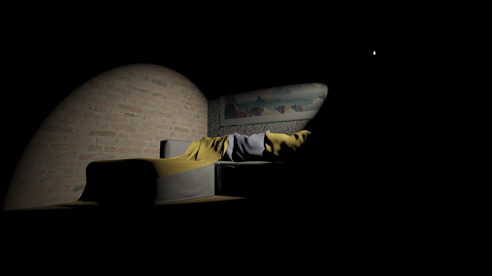
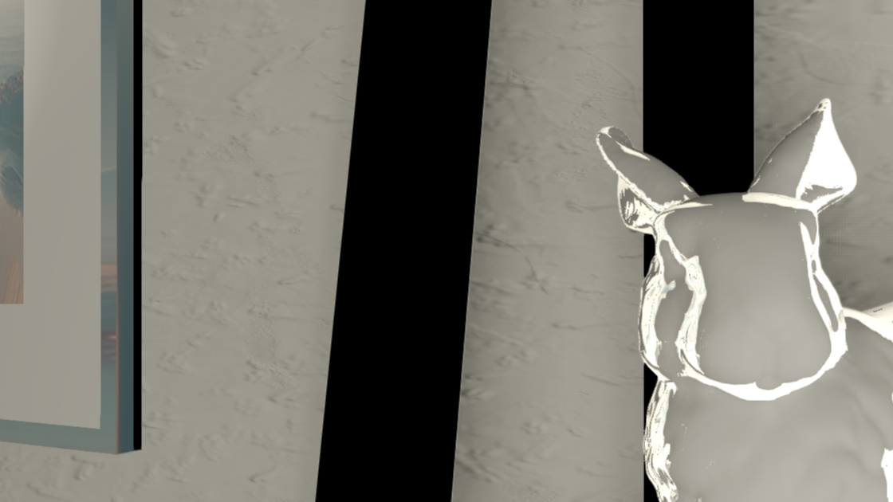
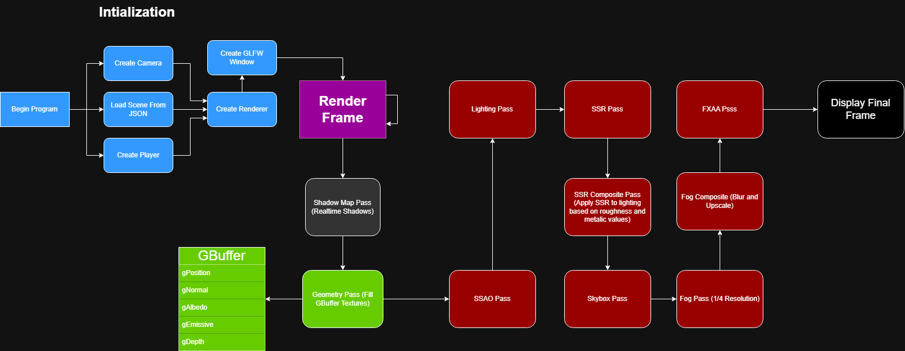
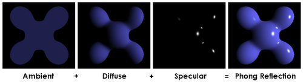
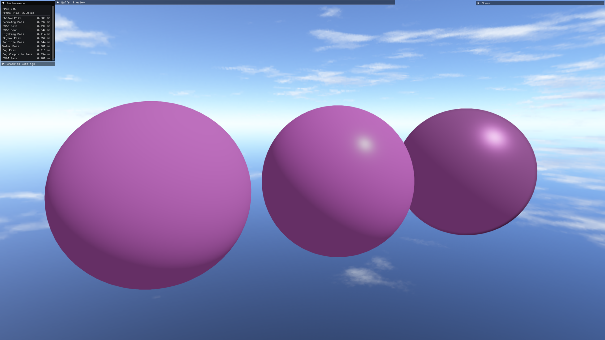
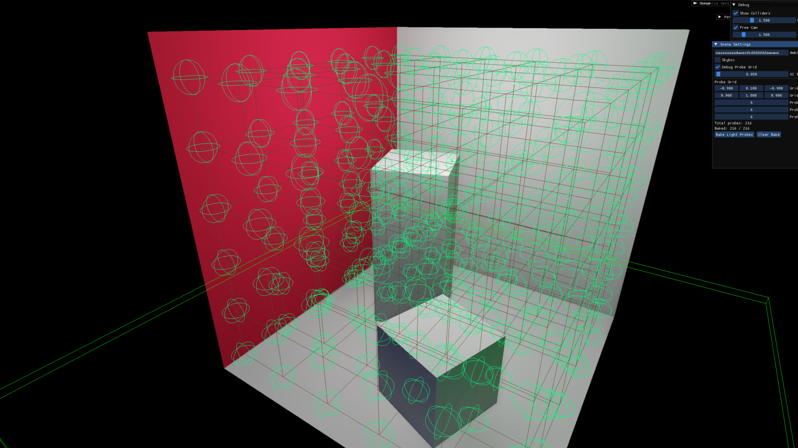
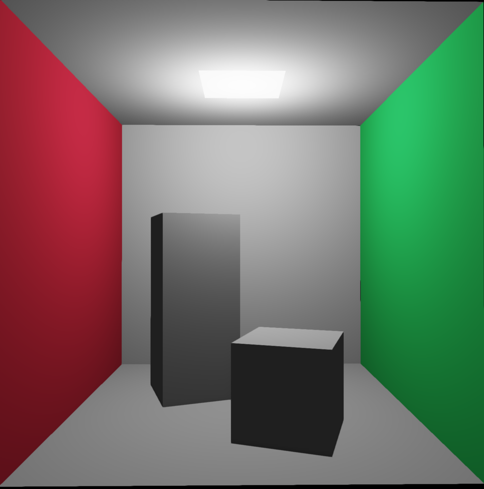
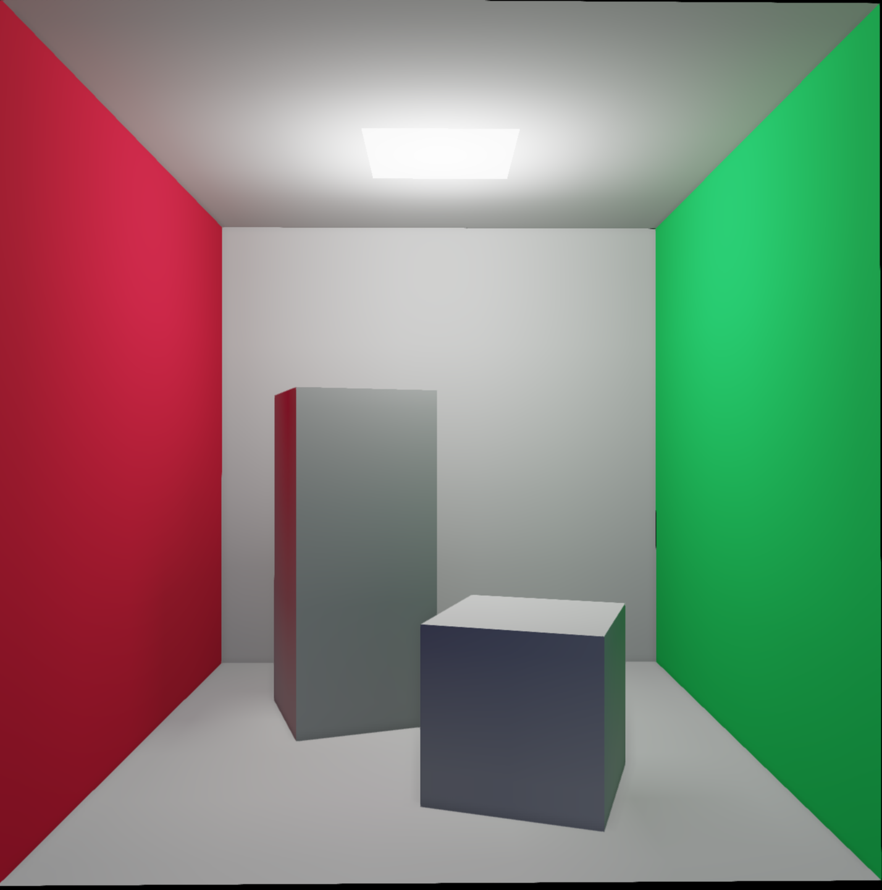
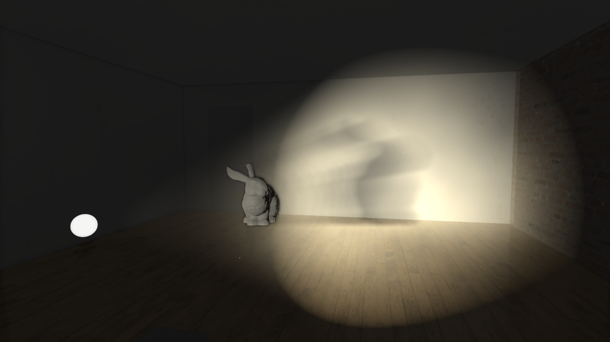
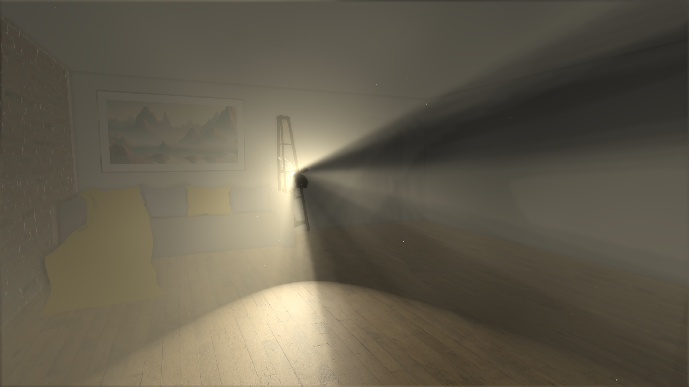

# Penumbra Rendering Engine
A real-time 3D graphics engine built in C++ and OpenGL, focused on implementing modern rendering techniques from scratch.


## Freatures

- **Deferred Physically Based Rendering**
- **Path Traced Spherical Harmonic Global Illumination**
- **Ray-marched Volumetric Fog**
- **Custom GPU Driven Lit Particles**
- **Screen Space Reflections (SSR)**
- **Screen Space Ambient Occlusion (SSAO)**
- **Fast Approximate Anti-Aliasing (FXAA)**
- **Normal and Parallax Mapping**
- **Custom GLSL #include Macros**
- **GLB Model Importing**
- **Scene Saving and Loading using JSON**
- **GameObject Components**
- **Jolt Physics System**

## Screenshots

| **Global Illumination** Off       | **Global Illumination** On       |
|-------------------------------|------------------------------|
|    |    |

| **SSAO** Off                      | **SSAO** On                      |
|-------------------------------|------------------------------|
|  |  |

| **Fog** Off                      | **Fog** On                      |
|------------------------------|-----------------------------|
|  |  |

| **SSR** Off                      | **SSR** On                      |
|------------------------------|-----------------------------|
|  |  |

| **FXAA** Off                  | **FXAA** On                      |
|-------------------------------|------------------------------|
|  |  |

| **Normal Mapping**                   | **Parallax Mapping**                   |
|--------------------------------------|----------------------------------------|
|  |  |

# Under the hood:



## Deferred Rendering

Deferred rendering allows for massive light counts compared to forward rendering. By splitting the rendering into a 
Geometry Pass and Lighting Pass the lighting complexity depends on screen space instead of triangle count. A GBuffer class
is created to store the albedo, normals, position, and depth of the geometry in the scene into individual textures. This data
is then used in the lighting pass and subsequent passed to calculate lighting. This comes at the cost of using more GPU Memory.

## Physically Based Rendering (PBR)

Initially I used Blinn-Phong as a very simple lighting model.



Blinn-Phong has a few issues. The only real control you have over a material is the size of specular highlights and intensity of
ambient light. Effectively you can shade something more or less shiny and more or less bright. Blinn-Phong also does not guarantee
the conservation of energy of incoming and outgoing light. Meaning incoming light can produce far brighter and energetic specular reflections.
However, real materials do not behave in this way.
Rough surfaces have tiny microfacets that catch and scatter light in random directions while smoother objects tend to reflect light in a 
more predictable manner. To have realistic assets we have to simulate this. 

I moved from Blinn-Phong to the Cook-Torrance BRDF. A Bidirectional Reflectance Distribution Function (BRDF) is a set of functions that 
determines how what direction incoming light will reflect off a surface. To have realistic rendering I moved to a Material system where 
each material is defined by:

- **Albedo** - base color of the surface
- **Roughness** - how rough or smooth the surface is, affecting the randomness of dispersion for incoming light
- **Metallic** — whether the surface is a metal or non-metal. Metals absorb
  the diffuse term and tint their reflections with the albedo color, while
  non-metals reflect a flat ~4% of light

To save GBuffer memory I packed roughness into the normal texture's alpha channel and metalic into albedo's alpha. This kept the
GBuffer at only 4 textures.

The Specular term is computed using three functions:

- **GGX NDF** - models the distribution of the microfacet normals
- **Smith-Schlick Geometry** - microfacet self shadowing
- **Fresnel-Schlick** - approximates how reflectance increases at grazing angles

The diffuse and specular terms are energy conserving. kS (fresnel) represents the reflected refraction and kD = (1 - kS) * (1 - metalic).

Lighting is calculated per light source and accumulated, with Reinhard tonemapping
and gamma correction applied in the final step.



## Baked Light Probe Global Illumination (GI)

I opted for prebaked GI for greater performance. There are three GI modes in this renderer: 
1) Constant Ambient Light
2) Rasterized Light Probes
3) Path Traced Light Probes

Mode 1 is just a basic ambient light value applied in the lighting pass.

Modes 2 and 3 use a 3D grid of probes to store baked light data:



At each point in the grid stores the surrounding light data. My initial thought was to store a light probe as a cube map. A single 128x128 RGB cube
map with an 8-bit color channel is roughly 300 KB. Considering there may be hundreds or thousands of probes in a scene this is far too much
memory to keep on the GPU. While researching baked GI methods I came across a way of storing this data in an extremely compact
format using **Spherical Harmonics (SH)**. While not intuitive, I was able to us SH thanks to some fantastic resources: 

[Great Conceptual Explanation](https://www.youtube.com/watch?v=cddCr95fnvI)

[SH Basis Functions](https://beatthezombie.github.io/sh_post_1/)

[Practical Use of SH](https://www.ppsloan.org/publications/StupidSH36.pdf)

I won't go into what SH is, but I will explain what it allows for. I used 2nd order SH therefore there are 9 SH coefficients 
per color channel. Using RGB gives us 27 floats to encode our color data into per light probe. 
This is only **108 bytes** compared to nearly **300 KB** with the cube map approach.
For each direction in the cube map we tune the values of each color channel's SH coefficients based on the color at that direction.
Now the lighting data is encoded we will then decode it and interpolate between the closest probes to get the GI value at a pixel.
Obviously cramming lighting data into only 108 bytes will result in loss of lighting accuracy, however the memory savings are well worth it.
The lighting is blurrier than the cube map solution but this isn't as much of a problem because GI is more subtle and 
doesn't require as much detail. Another tradeoff to this approach is increased compute due to decoding SH at runtime instead of
holding more lighting data in memory. 

Using SH as a hyper memory efficient lighting storage system we can calculate GI however we wish and store it cheaply. 
GI Mode 2 uses rasterization to capture the surrounding area and feeds a temporary cube map to tune its SH coefficients.
GI Mode 3 uses **CPU Path Tracing** to capture the surrounding color data and tune its SH coefficients. I used NanoRT to
create a CPU based Path Tracer to bake each light probe. Path Tracing produces far more accurate lighting than rasterization
because it bounces light rays in the scene to determine colors with an obvious performance drawback. Using more advanced GI
methods allows for brighter shadows and realistic color bleeding:

| Ambient Light (Mode 1)          | Path Traced Light Probe (Mode 3) |
|---------------------------------|----------------------------------|
|  |     |

## Volumetric Fog

Fog is implemented as a ray marched volume defined by an AABB (Axis Aligned Bounding Box). A ray is cast from the camera to each pixel's world
position and sampled at regular intervals inside the volume. At each sample point the fog density is modulated by a tiled 
scrolling 3D Perlin noise texture to break up the uniformity and give the fog a wispy appearance.

Each sample point also evaluates the full light list including shadow map lookups, so the fog correctly receives shadows 
and colored light from point, spot, and directional lights. The result is accumulated with physically based transmittance 
using Beer's Law.

To keep the cost down the fog is rendered at a reduced resolution and upscaled
with a blur composite pass before being blended over the lit scene.




## Custom GPU Driven Lit Particles

Particles are simulated entirely on the GPU using a compute shader. Dead particles are
respawned at a random position within a configurable bounding box with a
randomized velocity, size, and lifetime.

Lit particles are rendered as point sprites and receive the full shadow map
and point shadow cubemap lighting, making them respond correctly to scene
lights rather than being flat-shaded.

## Screen Space Reflection

SSR computes reflections by raymarching in world space along the reflection
vector derived from the GBuffer normal. At each step the ray position is
projected into screen space and compared against the scene depth stored in
the GBuffer. A hit is registered when the ray passes behind existing geometry
within a small thickness threshold.

The composite pass blends SSR hits weighted by a Fresnel term so only surfaces at glancing
angles receive strong reflections. Metallic surfaces receive more intense
reflections since their Fresnel F0 approaches 1.

## Screen Space Ambient Occlusion

SSAO approximates how much ambient light reaches a point by sampling the
surrounding hemisphere in view space. A TBN matrix is constructed per pixel
using a random noise texture to orient the hemisphere kernel, then 64 sample
points are projected into screen space and compared against the scene depth.

The raw SSAO output is then run through a 5x5 box blur pass to smooth out the
noise introduced by the small kernel and randomized sample orientations.

# Building

This project is configured for **CLion** on Windows. To build:

1. Clone the repository recursively to get all submodules 
   \```
   git clone --recursive https://github.com/rcm7133/Penumbra.git
   \```
2. Open the project folder in CLion
3. Let CLion configure the CMake project
4. Build and run with the provided run configuration

**Requirements:** Windows, OpenGL 4.6 capable GPU

# Usage

- **Shift + F10** to run
- 1 to Toggle Free Cam
- 2 to Toggle GUI
- 3 to Toggle GI Modes

## Dependencies

| Library | Purpose | License |
|---|---|---|
| [GLAD](https://github.com/Dav1dde/glad) | OpenGL loader | MIT |
| [GLM](https://github.com/g-truc/glm) | Math library | MIT |
| [GLFW](https://github.com/glfw/glfw) | Window and input | Zlib |
| [ImGui](https://github.com/ocornut/imgui) | Debug UI | MIT |
| [nanoRT](https://github.com/lighttransport/nanort) | CPU ray tracing for GI baking | MIT |
| [cgltf](https://github.com/jkuhlmann/cgltf) | GLB/GLTF model loading | MIT |
| [stb_image](https://github.com/nothings/stb) | Image loading | MIT/Public Domain |
| [nlohmann JSON](https://github.com/nlohmann/json) | Scene saving and loading | MIT |
| [Jolt Physics](https://github.com/jrouwe/JoltPhysics) | Physics simulation | MIT |